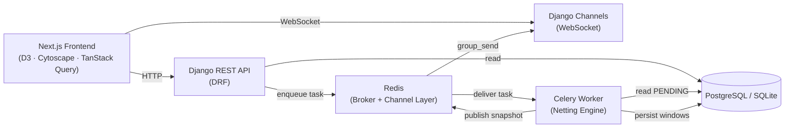
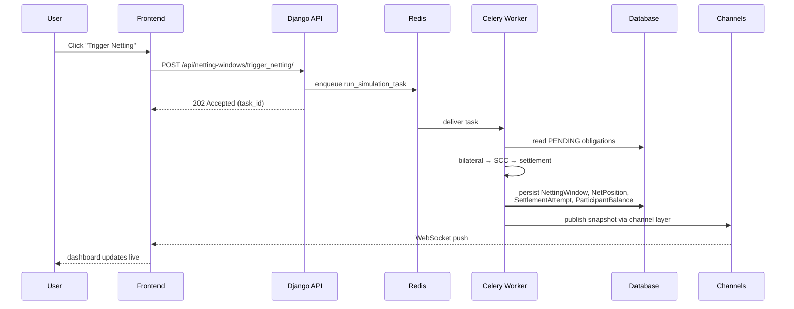
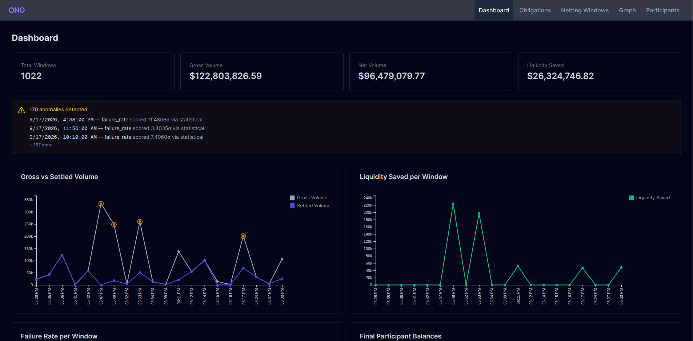
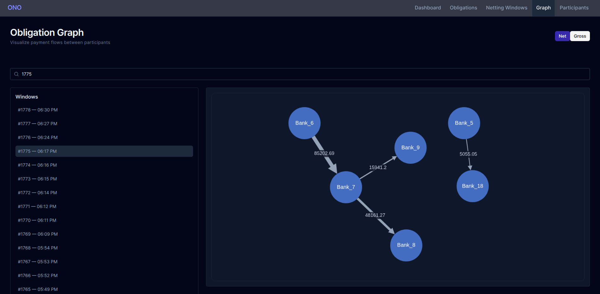
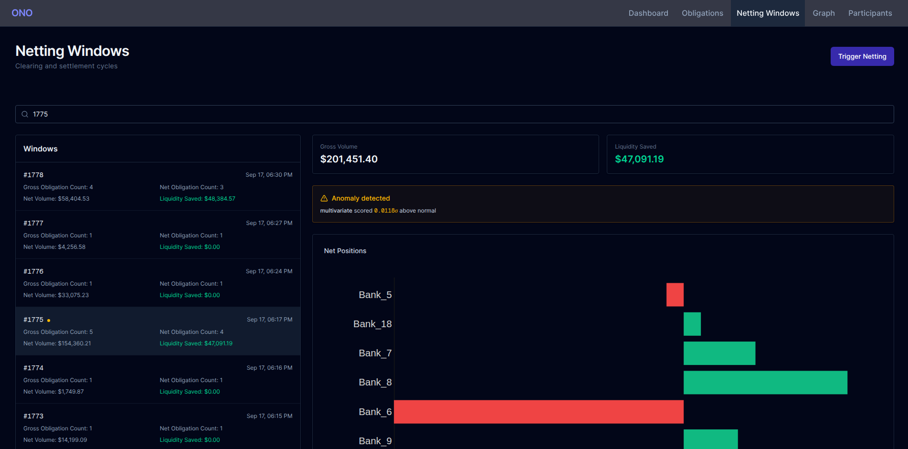

<!-- omit in toc -->
# Obligation Net Optimizer (ONO)

[](https://github.com/vridhib/obligation-net-optimizer/actions/workflows/tests.yml)
[](https://opensource.org/licenses/MIT)
[](https://www.python.org/)
[](https://www.djangoproject.com/)
[](https://nextjs.org/)

<!-- omit in toc -->
## Table of Contents
- [Overview](#overview)
- [Architecture](#architecture)
  - [System](#system)
  - [Request Flow](#request-flow)
- [Tech Stack](#tech-stack)
- [Algorithmic Core](#algorithmic-core)
- [UI Screenshots](#ui-screenshots)
  - [Dashboard with KPI Cards and Charts](#dashboard-with-kpi-cards-and-charts)
  - [Obligation Graph with Gross/Net Toggle](#obligation-graph-with-grossnet-toggle)
  - [Master-Detail Netting Window View](#master-detail-netting-window-view)
- [Running Locally](#running-locally)
  - [Prerequisites](#prerequisites)
  - [Clone the Repository](#clone-the-repository)
  - [Backend](#backend)
  - [Frontend](#frontend)
  - [Trigger a Netting Run](#trigger-a-netting-run)
  - [Testing](#testing)
  - [API endpoints](#api-endpoints)
  - [Design Decisions \& Limitations](#design-decisions--limitations)
    - [Considered \& Not Built](#considered--not-built)
    - [Known Limitations](#known-limitations)
- [License](#license)


---

## Overview

Obligation Net Optimizer (ONO) is a real-time multilateral netting and settlement engine for interbank payment obligations, with a full-stack dashboard, asynchronous processing, and live WebSocket updates. 

In payment networks, obligations accrue throughout the day. Settling each one gross ties up liquidity and creates cascading settlement risk. ONO applies bilateral netting, multilateral netting via Strongly Connected Components (Tarjan's algorithm), and a liquidity-aware settlement scheduler to reduce gross obligations to a minimal set of net payments. This is the same principle used by clearing houses like CHIPS and TARGET2.

It ingests a stream of obligations, maintains a live directed obligation graph, processes netting windows on a schedule, and pushes results to a browser dashboard in real time.

**Technical design:** [docs/TDD.md](docs/TDD.md)

---

## Architecture

### System

### Request Flow



---

## Tech Stack

**Backend**
- Python 3.11, Django 5.2, Django REST Framework
- Celery + Redis (async task queue + channel layer)
- Django Channels + Daphne (WebSocket / ASGI)
- PostgreSQL (SQLite for local dev)
- pytest, pytest-django, factory_boy, pytest-asyncio
- scikit-learn, statsmodels (anomaly detection)

**Frontend**
- Next.js 16 (App Router), React, TypeScript
- TailwindCSS
- TanStack Query (server state)
- D3 (line/bar charts), Cytoscape (force-directed obligation graph)

---

## Algorithmic Core

| Stage | Algorithm | Complexity |
|-------|-----------|------------|
| Bilateral netting | Hash map aggregation | O(E) |
| Multilateral netting | Tarjan's SCC (iterative) | O(V + E) |
| Settlement scheduling | Priority queue (FIFO + amount) | O(P log P) |

After bilateral netting removes contradictory pairs, multilateral netting collapses each SCC into a hub settlement, eliminating internal cycles. The result is a DAG of net payments that a scheduler can settle in a single pass with bounded liquidity.

---

## UI Screenshots

### Dashboard with KPI Cards and Charts
 - 
### Obligation Graph with Gross/Net Toggle

### Master-Detail Netting Window View


---

## Running Locally

### Prerequisites
- Python 3.11+ 
- Node.js 20+
- Redis 7+

### Clone the Repository
```bash
git clone https://github.com/vridhib/obligation-net-optimizer
cd obligation-net-optimizer
```

### Backend

```bash
cd backend
python -m venv .venv && source .venv/bin/activate
pip install -r requirements.txt
python manage.py migrate

# Generate synthetic obligations
python manage.py generate_obligations --cycles 50 --noise 3

# Terminal 1: ASGI server (WebSocket + HTTP)
daphne config.asgi:application

# Terminal 2: Celery worker
celery -A config worker -l info
```

### Frontend
```bash
cd frontend
npm install
npm run dev
```
Open http://localhost:3000.

### Trigger a Netting Run
``` bash
curl -X POST http://localhost:8000/api/netting-windows/trigger_netting/
```
Watch the dashboard update in real time.

### Testing
```bash
cd backend
pytest                    # all tests
pytest --cov=.            # with coverage
```
Test suite is hermetic: uses channels.layers.InMemoryChannelLayer and eager Celery, so no Redis is required for CI.

### API endpoints
| Method | Endpoint                                         | Description                             |
|--------|--------------------------------------------------|-----------------------------------------|
| POST	 | /api/obligations/	                              | Submit a single obligation              |
| POST	 | /api/obligations/bulk/	                          | Bulk upload (CSV or JSON)               |
| GET	   | /api/netting-windows/	                          | List netting windows                    |
| POST	 | /api/netting-windows/trigger_netting/	          | Trigger async simulation                |
| GET	   | /api/netting-windows/positions/?window=latest  	| Net positions for a window              |
| GET	   | /api/netting-windows/summary/	                  | Aggregate liquidity and failure metrics |
| GET	   | /api/netting-windows/graph/?window=ID&view=gross | Graph data for visualization            |
| GET	   | /api/netting-windows/anomalies/   	              | Detected anomalies across windows       |
| GET	   | /api/participants/	                              | Participant balances                    |
| WS     | /ws/obligations/	                                | Real-time snapshot updates              |


### Design Decisions & Limitations

#### Considered & Not Built

**Greedy settlement minimization**: Replacing hub settlement with a greedy debtor-creditor matching reduces payment volume on dense cycles. This was rejected because realistic interbank graphs are sparse (SCCs of size 2–5), where hub settlement is already near-optimal. The added complexity was not justified.

**Automatic retry of failed settlements**: Settlement failures currently stay terminal. Automatic retry requires a scheduler-driven window policy and a formal retry budget, which is beyond the scope of this project. Real clearinghouses often require operator intervention rather than infinite retry.

#### Known Limitations

**Synthetic data**: The generator produces clusters and cycles but does not model real interbank topology or intaday volume patterns.

**Univariate anomaly detection**: The z-score tier flags individual metrics (failure rate and gross volume) against a rolling baseline. It does not account for cross-participant effects like correlated failures.

**No authentication**: The API is open. In production, it would require JWT or OAuth and per-endpoint scopes.

**In-memory obligation store**: `ObligationStore` is process-local. Horizontal scaling would require a shared buffer such as Redis streams.


## License
This project is licensed under the MIT License. See the [full license text](/LICENSE) for details.