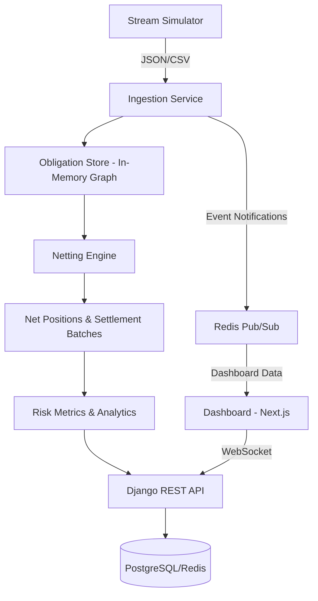

# Obligation Net Optimizer (ONO) - Technical Design Document

## Overview & Problem Statement

In payment networks (inter-bank, card schemes, broker-dealer clearing) gross settlement ties up massive intraday liquidity and creates a propagation of settlement risk. Clearing houses use tailored algorithms to net millions of transactions. 

This project is a real-time multilateral netting and settlement risk engine that ingests a stream of payment obligations, maintains a dynamic obligation graph, and continuously computes optimal net positions and settlement batches to minimize liquidity usage and settlement failures. Obligation Net Optimizer (ONO) is a portfolio-grade demo of a real-time financial infrastructure component that combines streaming data processing with custom graph algorithms (SCC-based netting and priority-queue scheduling), with an exposed REST API and an interactive dashboard.

## Goals & Non-Goals

### Goals

- Ingest a continuous stream of payment instructions (synthetic data).
- Maintain an in-memory obligation graph with efficient updates.
- Implement bilateral and multilateral netting using Strongly Connected Components.
- Simulate settlement scheduling with liquidity constraints.
- Provide a REST API and a real-time visualization dashboard.
- Measure and display liquidity savings, settlement risk, and system throughput. 

### Non-Goals

- Production-grade security or fault tolerance.
- Support for multiple currencies (initially USD only).
- Integration with real SWIFT/ISO 20022 messages (starts with a simplified schema).
- Distributed processing or persistence to a ledger (in-memory first, optional DB logging).


### System Architecture (High Level)



- **Stream Simulator**: Python script that generates realistic payment flows with built-in cycles and clusters.
- **Ingestion Service**: Django management command or background worker that reads the stream, updates the in-memory obligation graph, and emits events.
- **Obligation Store**: Python data structures (`defaultdict(deque)`) with O(1) inserts and removals; timestamp-indexed for window expiration.
- **Netting Engine**: Triggered periodically (e.g., every minute) or on-demand. Runs bilateral netting then SCC (Strong Connected Components) detection, produces net positions.
- **Settlement Simulator**: Uses a max-heap scheduler to settle net payments while respecting liquidity balances. It also calcualates metrics.
- **API & Dashboard**: Django/DRF serves netting results, metrics, and graph snapshots; Next.js visualized the obligation graph before and after netting.


### Data Model & Schema

#### Overview

- **Input Obligation (JSON/CSV)**: `tx_id`, `payer`, `payee`, `amount`, `currency`, `timestamp`
- **In-memory Representation**: `obligations[payer][payee]` --> `deque`of `(tx_id, amount, timestamp)`. Global `deque` of all pending transactions for window management.
- **Net Position Record (API Output)**: `participant`, `net_amount` (positive = credit), `window_start`, `window_end`
- **DB Tables (Django Models)**: `Obligation` (logged), `NettingWindow`, `NetPosition`, `SettlementAttempt`
- Deques chosen for O(1) popleft when expiring old obligations
- Double-level defaultdict for fast lookup by counterparty pair.
- Net positions recalculated per window; historical positions stored for analytics.

#### Schema

| Model/Table | Fields | Description |
| ----------- | ------ | ----------- |
| Obligation | `tx_id`, `payer`, `payee`, `amount`, `currency`, `timestamp`, `status`, `netting_window` | Payment obligations that need to be settled |
| NettingWindow| `window_id`, `start_time`, `end_time`, `gross_obligation_count`, `net_obligation_count`, `net_volume`, `liquidity_saved`, `created_at` | Each netting cycle creates a netting window | 
|NetPosition| `window`, `participant`, `net_amount`| The net amount owed by a participant |
|SettlementAttempt| `window`, `payer`, `payee`, `amount`, `priority`, `attempt_number`, `result`, `timestamp` | Record of an attempted net payment during the settlement |
| ParticipantBalance | `participant`, `balance`, `timestamp` | Optional participant snapshot for faster frontend |

#### In-Memory Data Structures

  - obligations: defaultdict(lambda: defaultdict(deque)), obligations[payer][payee] -> deque of (tx_id, amount, timestamp)
  - global_pending: deque of tx_id (ordered by timestamp, used for window expiry)
  - net_positions_cache: dict[participant, Decimals] (latest window net position)
  - balances: dict[participant, Decimal] (current liquidity)


### Core Algorithm Design

#### 1. Bilateral Netting

**Objective**: For each directed pair `(u, v)`, compute net obligation: `net = sum(u->v) - sum(v->u)`. If `net > 0`, keep edge `u->v` with amount `net`, else if `net < 0`, reverse edge.

**Complexity**: O(E) using hash map aggregation.

**Output**: A simpler directed graph with no contradictory edges.

#### 2. Multilateral Netting via SCC

**Rationale**: Within a strongly connected component, every node can reach every other; obligations can be netted down to per-node net positions, eliminating internal cycles.

**Algorithm**: Tarjan’s Strongly Connected Components (O(V+E)).

- Build adjacency list from netted graph.
- Run Tarjan’s to find SCCs.
- For each SCC with `size > 1`:
  - Calculate for each node: `out_total` (sum of outgoing amounts within SCC), `in_total` (sum of incoming amounts within SCC).
  - Net position = `in_total - out_total`.
  - Replace internal edges with a single net payment per node (if non-zero) to a designated SCC settlement node, or keep as net positions.

**Post-processing**: The resulting graph after SCC netting has a DAG structure (no cycles). This can be settled more efficiently.

#### 3. Settlement Scheduling with Liquidity Constraints
**Input**: List of net payments (payer, payee, amount) + initial liquidity balances.

**Approach**:

- Use a max-heap keyed by `(amount, timestamp)` to prioritize large/old payments.
- While heap not empty: pop payment; if payer has sufficient balance, execute (update balances), else push to failed_queue.
- After one pass, reattempt failed payments once (or multiple times if liquidity increases from other settlements) or mark as settlement failures.

**Metrics**: Total liquidity used, number of failed settlements, gross vs net volume.

#### 4. Novel Extension: Greedy Cycle Detection for Efficiency

To find cycles not captured by full SCC (e.g., a small cycle inside a larger DAG), implement a DFS with backtracking and timeout, searching for simple cycles of length ≤ 4 where the product of exchange rates (or sums) yields a netting benefit. This demonstrates advanced algorithm design and can be toggled on/off for comparison.

### Algorithm Pseudocode

#### 1. Bilateral Netting

```text
  Input: dict payer -> dict dayee -> deque of (tx_id, amount, timestamp)
  Ouput: list of payer, payee, net_amount

  function bilateral_net(obligations):
    netted_edges = empty list
    # Aggregate all obligations between each pair
    gross = empty dict
    for payer in obligations:
      for payee in obligations[payer]:
        total = sum of all obligations
        gross[payer][payee] = total

    # Compute net per directed pair
    processed_pairs = empty set
    for payer in gross:
      for payee in gross[payer]:
        # Skip if handled in other direction
        if (payer, payee) in processed_pairs: 
          continue
        processed_pairs.add((payer, payee))

        amount_a_to_b = gross[payer][payee]
        amount_b_to_a = gross[payee][payer]

        net = amount_a_to_b - amount_b_to_a
        if net > 0:
          netted_edges.append((payer, payee, net))
        if net < 0:
          netted_edges.append((payee, payer, -net))
        # if net == 0, no edge remains

    return netted_edges
```  
*Note: This runs in O(E) time because it iterates over every stored obligation pair once, which results in a list of edges with no contradicting pairs. It is later converted into a new adjancency list later for the SCC step.*

#### 2. Multilateral Netting Via SCC

```text
  Input: directed graph G as adjacency list (node -> list of (neighbor, amount))
  Output: list of SCCs, each with net positions for its nodes

  function tarjan_scc_netting(G):
    index = 0
    stack = empty list
    on_stack = empty set
    indices = empty dict   # node -> discovery index
    low_link = empty dict  # node -> lowlink value
    sccs = []              # holds lists of nodes in each SCC

  function strong_connect(v):
    indices[v] = index
    low_link[v] = index
    index += 1
    stack.append(v)
    on_stack.add(v)

    for (w, amount) in G[v]:
      if w not in indices:
        strong_connect(w)
        low_link[v] = min(low_link[v], low_link[w])
      else if w in on_stack:
        low_link[v] = min(low_link[v], indices[w])

    # If v is a root node, pop the stack and form an SCC
    if low_link[v] == indices[v]:
      scc = []
      while True:
        w = stack.pop() 
        on_stack.remove(w)
        scc.append(w)
        if w == v:
          break
      sccs.append(scc)

    # Run on all nodes
    for v in G:
      if v not in indices:
        strong_connect(v)

    # Compute net positions for each SCC with size > 1
    net_positions = dict      # participant -> net amount

    for scc in sccs:
      if length(scc) <= 1:
        continue
      # Build dictionary for in/out totals with SCC
      scc_set = set(scc)
      in_total = dict
      out_total = dict
      for u in scc:
        for (v, amt) in G[u]:
          if v in scc_set:
            in_total[v] += amt
            out_total[u] += amt
      # Replace internal edges w/ single net payment per node if != 0
      for node in scc:
        net = in_total[node] - out_total[node]
        if net != 0:
          net_positions[node] = net
    return sccs, net_positions
```
*Note: The `net_positions` replace internal edges. Payments between SCCs are computed from original edges between nodes in different SCCs, adjusted by net positions. If the graph has thousands of nodes, Python's default recursion limit could be hit. There are two solutions for this: add a recursion limit or implement an iterative version.*

#### 3. Settlement Scheduling with Liquidity Constraints

```text
  Input: list of (payer, payee, amounts), dict participant -> available liquidity
  Output: settlement_result with metrics

  function settlement_scheduler(net_payments, initial_balances):
    balances = copy of initial balances
    heap = empty max heap
    for (payer, payee, amount) in net_payments:
      heap.push((-amount, timestamp_from_payment, payer, payee))

    settled = []
    failed = []

    # First pass
    while heap is not empty:
      (neg_amt, ts, payer, payee) = heap.pop()
      amount = -neg_amt
      if balances[payer] >= amount:
        balances[payer] -= amount
        balances[payee] += amount
        settled.append((payer, payee, amount))
      else:
        failed.append((payer, payee, amount))

    # Second pass for failed payments
    for (payer, payee, amount) in failed:
      if balances[payer] >= amount:
        balances[payer] -= amount
        balances[payee] += amount
        settled.append((payer, payee, amount))
        failed.remove((payer, payee, amount))
    
    # Compute metrics
    total_settled = sum(amt for (_, _, amt) in settled)
    total_failed = sum(amt for (_, _, amt) in failed)
    failure_rate = total_failed / (total_settled + total_failed) if any else 0

    return {
      'settled': settled,
      'failed': failed,
      'final_balances': balances,
      'total_settled': total_settled,
      'total_failed': total_failed,
      'failure_rate': failure_rate
    }
```
*Note: can also add priority queue that considers payment urgency based on age. Instead of retrying failed payment attempts once, can later add a `failed_queue` and re-attempt later when other payments bring liquidity to the payer.*


### API Design (Django REST Framework)
| Endpoint | Description |
| -------- | ----------- |
| `POST /api/obligations/` | Submit a single obligation. |
| `POST /api/obligations/bulk/` | Submit a batch (CSV/JSON). |
| `POST /api/netting/trigger/` | Force a netting cycle. |
| `GET /api/netting/positions/?window=latest` | Retrieve net positions for a given window. |
| `GET /api/netting/summary/` | Liquidity savings, graph size before/after, settlement stats. |
| `GET /api/participants/` | List of entities and their balances. |
| `WS /ws/obligations/` | WebSocket endpoint for real-time graph updates (using Django Channels). |

### Dashboard (Next.js) Features
- Force-directed graph of current obligations, with edges colored by amount.
- Toggle between gross view and net view; animate the collapse of cycles.
- Line chart of cumulative liquidity savings over time.
- Settlement risk heatmap (participants with high net debit vs. low balance).
- Control panel to start/stop stream, adjust netting interval.


### Technology Stack & Rationale
|Layer	| Technology | Why |
| ----- | --------- | ----|
|Core Engine	|Python 3.12+ |Data processing, algorithm implementation, pandas integration
|Graph Algorithms	|Custom (no networkx for production code)	|To practice DSA with a real-use case; pandas only for EDA (Exploratory Data Analysis) and analytics
|Web Framework	|Django 4.2 LTS + DRF	|Robust for REST APIs
|Real-time Updates	|Django Channels + Redis	|WebSocket communication for live graph
|Frontend	|Next.js + D3.js / Cytoscape.js	|Smooth graph visualizations
|Data Generation & Analysis	|pandas, numpy, matplotlib|	Exploratory analysis, stream generation, metrics plotting
|Testing	|pytest	|Unit tests for netting, integration tests for API


### Implementation Roadmap

|Phase	|Duration	| Deliverable |
| ----- | --------- | ----------- |
| Planning & Data Generation	|1 week	| Schema design, synthetic data generator script (pandas used to create realistic payment networks with clusters), basic Django project setup.
| Static Netting Engine	|2 weeks	|Implement bilateral netting, SCC algorithm, and net position computation. Test with small hand-crafted examples. Unit tests with pytest.
| Dynamic Stream Simulation	|1.5 weeks	|Build an in-memory obligation store with deque, streaming ingestion from a CSV/API, incremental updates. Keep a running snapshot of net positions.
| Settlement Simulator & Risk Metrics	|1.5 weeks	|Add liquidity balancing, heap-based scheduler, compute metrics like gross-vs-net settlement amounts, liquidity usage, and failure rates. Visualize these with matplotlib/pandas.
| API & Backend Integration	|1 week	|Expose endpoints: submit obligation, trigger netting, query net positions. Use Django REST Framework, possibly Celery for periodic netting.
| Dashboard (Next.js)	|1 week	|Real-time graph visualization (D3/Cytoscape) of obligations before and after netting, liquidity plots.
| Polish & Documentation	|1 week	|README with architecture diagram, demo video with captions, detailed explanation of algorithms, deployment instructions.